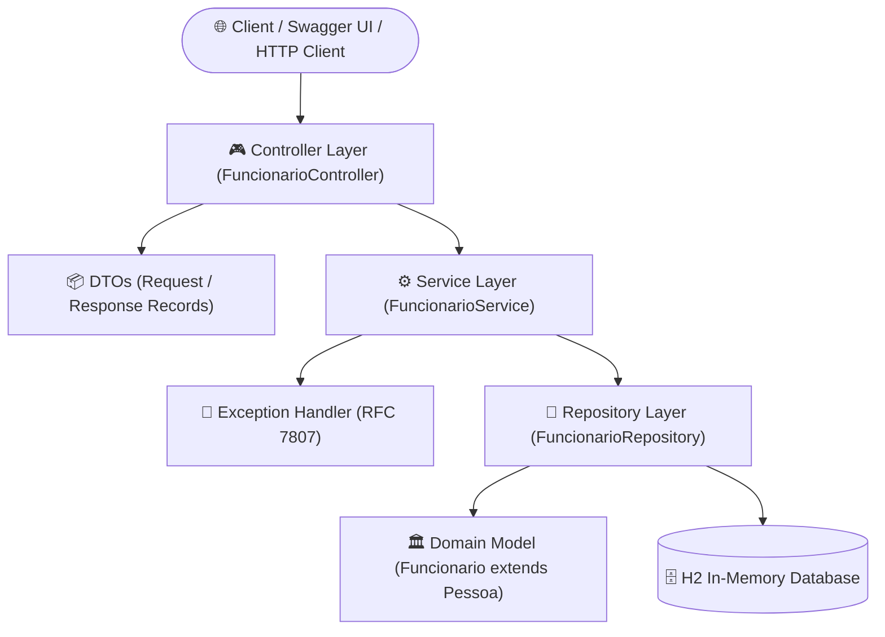

# 🚀 Employee Management API - Projedata

[](https://www.oracle.com/java/)
[](https://spring.io/projects/spring-boot)
[](https://www.docker.com/)
[](https://swagger.io/)
[](https://opensource.org/licenses/MIT)

> 🇧🇷 [**Versão em Português**](README.md) | 🇺🇸 **English**

High-performance enterprise RESTful API for employee administration, payroll processing, batch percentage salary raises, and statistical insights. Built with **Java 21 LTS**, **Spring Boot 3.4.3**, **Spring Data JPA**, in-memory **H2 Database**, interactive documentation via **Swagger UI (OpenAPI 3)**, and containerization using **Docker & Docker Compose**.

---

## 📌 Table of Contents / Quick Navigation

- [📝 About the Project](#-about-the-project)
- [🖼️ Preview](#️-preview)
- [🌐 Live Swagger Demo](#-live-swagger-demo)
- [⚡ API Endpoints](#-api-endpoints)
- [✨ Features](#-features)
- [🛠️ Technologies and Tools](#️-technologies-and-tools)
- [🏛️ Solution Architecture](#️-solution-architecture)
- [📁 Repository Structure](#-repository-structure)
- [💡 Technical Decisions](#-technical-decisions)
- [🚀 How to Run the Project](#-how-to-run-the-project)
  - [Prerequisites](#prerequisites)
  - [Option 1: Via Docker Compose (Recommended)](#option-1-via-docker-compose-recommended)
  - [Option 2: Via Maven CLI](#option-2-via-maven-cli)
  - [Option 3: Running via IDE](#option-3-running-via-ide)
- [🔍 Useful Links & Access while Running](#-useful-links--access-while-running)
- [📄 License](#-license)

---

## 📝 About the Project

This project was initially designed following the technical assessment requirements from **Projedata** for the Software Developer role and was subsequently enhanced to meet rigorous corporate software engineering standards.

The application models complete workforce management (`Pessoa` and `Funcionario`), orchestrating employee creation, deletion by ID and name, transactional batch percentage salary increases, dynamic role grouping, filtering birthdays by specific months (months 10 and 12), finding the oldest employee, and computing each employee's salary ratio relative to the current minimum wage.

---

## 🖼️ Preview

<div align="center">
  
</div>

---

## 🌐 Live Swagger Demo

The application is deployed and available in the cloud for live testing:

👉 **[https://teste-pratico-projedata-4kpw.onrender.com/](https://teste-pratico-projedata-4kpw.onrender.com/)**

> Accessing the root `/` URL automatically redirects to Swagger UI (`/swagger-ui/index.html`).

---

## ⚡ API Endpoints

The API adheres to RESTful standards, delivering structured JSON payloads, semantic HTTP status codes, and automatic validation.

| Method | Endpoint | Description | Parameters / Body |
| :--- | :--- | :--- | :--- |
| `GET` | `/api/v1/funcionarios` | List all employees | `ordenarPorNome=true/false` *(default: false)* |
| `GET` | `/api/v1/funcionarios/{id}` | Retrieve employee by ID | `id` *(path variable)* |
| `POST` | `/api/v1/funcionarios` | Create a new employee | JSON Body (`FuncionarioRequestDTO`) |
| `DELETE` | `/api/v1/funcionarios/{id}` | Remove employee by ID | `id` *(path variable)* |
| `DELETE` | `/api/v1/funcionarios/nome/{nome}` | Remove employee by Name *(Req. 3.2)* | `nome` *(path variable)* |
| `PATCH` | `/api/v1/funcionarios/reajuste` | Apply batch percentage salary raise *(Req. 3.4)* | `percentual` *(query param, default: 10.0)* |
| `GET` | `/api/v1/funcionarios/agrupados-por-funcao` | Group employees by role/job title *(Req. 3.5 & 3.6)* | None |
| `GET` | `/api/v1/funcionarios/aniversariantes` | Filter birthdays by month *(Req. 3.8)* | `meses` *(query param, default: 10,12)* |
| `GET` | `/api/v1/funcionarios/mais-velho` | Get the oldest employee and computed age *(Req. 3.9)* | None |
| `GET` | `/api/v1/funcionarios/estatisticas/folha` | Total payroll & minimum wage multiples *(Req. 3.11 & 3.12)* | `salarioMinimo` *(query param, default: 1212.00)* |

---

## ✨ Features

- [x] **Automatic Data Seeding (Requirement 3.1):** Idempotent database population on startup with the 10 assessment employees via `DataInitializer`.
- [x] **Employee Deletion (Requirement 3.2):** Dynamic deletion by name (e.g., "João") and by primary key ID.
- [x] **Data Formatting & Display (Requirement 3.3):** Serialized responses with decimal precision and standard date formatting.
- [x] **Collective Salary Readjustment (Requirement 3.4):** Batch transactional update with specified percentage (e.g., +10%) using strict `BigDecimal` rounding.
- [x] **Role Grouping (Requirements 3.5 & 3.6):** Dynamic grouping `Map<String, List<Funcionario>>` using Java Stream API.
- [x] **Birthday Filtering (Requirement 3.8):** Flexible query parameterized by month list (defaults to October and December).
- [x] **Oldest Employee Identification (Requirement 3.9):** Locates the oldest employee computing exact years with `java.time.Period`.
- [x] **Alphabetical Ordering (Requirement 3.10):** List query with alphabetical sorting support via `ordenarPorNome`.
- [x] **Payroll Totals & Wage Multiples (Requirements 3.11 & 3.12):** Total payroll summation and calculation of how many minimum wages each employee earns.

---

## 🛠️ Technologies and Tools

| Layer / Purpose | Technology | Description |
| :--- | :--- | :--- |
| **Primary Language** | **Java 21 LTS** | Records, Pattern Matching, and JVM optimizations |
| **Web Framework** | **Spring Boot 3.4.3** | Modern dependency injection and enterprise web stack |
| **Data Persistence** | **Spring Data JPA / Hibernate** | Clean Object-Relational Mapping using `@MappedSuperclass` |
| **Database** | **H2 Database** | Fast in-memory SQL database for local and testing execution |
| **Validation** | **Jakarta Bean Validation** | Declarative request payload validation on DTO records |
| **Interactive Docs** | **Swagger UI / SpringDoc OpenAPI 2.8.5** | OpenAPI 3 documentation with built-in interactive testing console |
| **Automated Testing** | **JUnit 5 & Mockito** | Unit testing suite covering service layer and business rules |
| **Containerization** | **Docker & Docker Compose** | Multi-stage build producing a lightweight Alpine image |
| **Build Automation** | **Apache Maven** | Build lifecycle and dependency management |

---

## 🏛️ Solution Architecture

The application is structured into decoupled layers following **Clean Architecture**, **SOLID**, and **Domain-Driven Design (DDD)** concepts:



- **Controller:** REST entry points, routing, Swagger OpenAPI metadata, and payload validation.
- **DTO (Data Transfer Objects):** Immutable records decoupling external clients from internal database entities.
- **Service:** Business rules, financial calculations with `BigDecimal`, `@Transactional` management, and Stream pipelines.
- **Repository:** Data access abstraction using Spring Data JPA and query methods.
- **Model:** JPA domain entities (`Pessoa` as an abstract `@MappedSuperclass` and `Funcionario` as child entity).
- **Exception Handler:** `@RestControllerAdvice` global interceptor returning standard RFC 7807 (`ProblemDetail`) error bodies.

---

## 📁 Repository Structure

```text
teste-pratico-projedata/
├── src/
│   ├── main/
│   │   ├── java/com/projedata/
│   │   │   ├── config/              # OpenAPI/Swagger & Data Seeding Configurations
│   │   │   │   ├── DataInitializer.java
│   │   │   │   └── OpenApiConfig.java
│   │   │   ├── controller/          # REST Controllers
│   │   │   │   ├── FuncionarioController.java
│   │   │   │   └── HomeController.java
│   │   │   ├── dto/                 # Transfer and Statistical DTO Records
│   │   │   │   ├── FolhaEstatisticaResponseDTO.java
│   │   │   │   ├── FuncionarioMaisVelhoResponseDTO.java
│   │   │   │   ├── FuncionarioRequestDTO.java
│   │   │   │   └── FuncionarioResponseDTO.java
│   │   │   ├── exception/           # Global Error Handling (RFC 7807 ProblemDetail)
│   │   │   │   ├── GlobalExceptionHandler.java
│   │   │   │   └── ResourceNotFoundException.java
│   │   │   ├── model/               # JPA Domain Entities
│   │   │   │   ├── Funcionario.java
│   │   │   │   └── Pessoa.java
│   │   │   ├── repository/          # Spring Data JPA Repositories
│   │   │   │   └── FuncionarioRepository.java
│   │   │   ├── service/             # Business Logic & Financial Service Layer
│   │   │   │   └── FuncionarioService.java
│   │   │   └── ProjedataApplication.java  # Main Application Entry Point
│   │   └── resources/
│   │       └── application.yml      # Infrastructure, H2, and Swagger Configuration
│   └── test/
│       └── java/com/projedata/
│           └── service/
│               └── FuncionarioServiceTest.java # Unit Tests with JUnit 5 & Mockito
├── Dockerfile                       # Multi-stage build with Eclipse Temurin JRE Alpine
├── docker-compose.yml               # Production container orchestration
├── pom.xml                          # Maven dependencies and build plugins
├── LICENSE                          # MIT License
├── README.md                        # Documentation in Portuguese
└── README.en.md                     # Documentation in English
```

---

## 💡 Technical Decisions

1. **Java 21 LTS and Records:** Adopted Java Records for all input and output DTOs. This enforces immutability, avoids third-party boilerplate processors like Lombok, and eliminates boilerplate code (*getters, equals, hashCode, toString*).
2. **Strict Financial Precision (`BigDecimal`):** Salaries, percentage multipliers, and wage ratios strictly use `BigDecimal` with `RoundingMode.HALF_UP` and 2 decimal places, preventing floating-point precision loss.
3. **RFC 7807 Standard (`ProblemDetail`):** Application errors (such as `ResourceNotFoundException` and `@Valid` constraint violations) are intercepted by `@RestControllerAdvice` and rendered compliant with RFC 7807 specification.
4. **Inheritance with `@MappedSuperclass`:** The `Funcionario` entity inherits common properties (`id`, `nome`, `dataNascimento`) from the abstract superclass `Pessoa` via JPA `@MappedSuperclass`, producing clean relational schema (`tb_funcionarios`).
5. **Docker Multi-Stage Build:** The `Dockerfile` separates the Maven compilation environment from the final execution image (`eclipse-temurin:21-jre-alpine`), producing a minimal container image with reduced security footprint.
6. **Automatic Swagger Redirect:** `HomeController` automatically redirects the root URL (`/`) to `/swagger-ui/index.html` for a seamless developer and reviewer experience on cloud platforms.

---

## 🚀 How to Run the Project

### Prerequisites
- **Docker & Docker Compose** installed, **OR**
- **Java JDK 21** and **Apache Maven 3.8+** configured in PATH.

---

### Option 1: Via Docker Compose (Recommended)

The fastest way to spin up the containerized application:

```bash
# 1. Clone the repository
git clone https://github.com/ludson96/teste-pratico-projedata.git

# 2. Go to the project root directory
cd teste-pratico-projedata

# 3. Build and launch the container
docker compose up --build
```
> Run in background mode: `docker compose up -d`  
> Stop the container: `docker compose down`

---

### Option 2: Via Maven CLI

```bash
# 1. Clone and enter directory
git clone https://github.com/ludson96/teste-pratico-projedata.git
cd teste-pratico-projedata

# 2. Run unit tests
mvn clean test

# 3. Start the application
mvn spring-boot:run
```

---

### Option 3: Running via IDE

1. Open your IDE of choice (**IntelliJ IDEA**, **VS Code**, or **Eclipse**).
2. Open the project folder as a **Maven** project.
3. Configure the Project SDK to **Java 21**.
4. Run the `main` method in `com.projedata.ProjedataApplication`.

---

## 🔍 Useful Links & Access while Running

When the application is running locally on port `8080`:

| Resource | URL | Details |
| :--- | :--- | :--- |
| 📄 **Swagger UI** | [http://localhost:8080/swagger-ui.html](http://localhost:8080/swagger-ui.html) | Interactive API documentation |
| 📊 **OpenAPI JSON Spec** | [http://localhost:8080/v3/api-docs](http://localhost:8080/v3/api-docs) | OpenAPI 3 JSON specification |
| 🗄️ **H2 Web Console** | [http://localhost:8080/h2-console](http://localhost:8080/h2-console) | In-memory relational database console |

> **H2 Console Credentials:**  
> - **JDBC URL:** `jdbc:h2:mem:projedatadb`  
> - **User:** `sa`  
> - **Password:** *(leave blank)*

---

## 📄 License

This project is licensed under the [MIT License](LICENSE). Check the license file for details.
