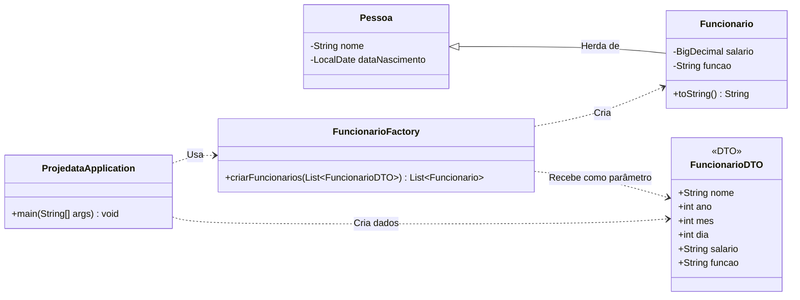

# Teste Prático - `Projedata`

Projeto desenvolvido como parte do processo seletivo para a vaga de `Desenvolvedor de Software Júnior - Área: Financeiro/Suprimentos`.

## Linguagens e ferramentas usadas

[![Git][Git-logo]][Git-url]
[![Java][Java-logo]][Java-url]

## 📝 O que foi desenvolvido

Esta é uma aplicação Java de console que gerencia uma lista de funcionários, implementando as funcionalidades solicitadas no teste técnico, como:

- Inserção e remoção de funcionários.
- Aumento salarial de 10%.
- Agrupamento de funcionários por função.
- Relatórios de aniversariantes, funcionário mais velho, ordem alfabética e total de salários.
- Cálculo de salários em múltiplos do salário mínimo.

## 🏛️ Arquitetura do Projeto



## 🚀 Como Executar

1. **Pré-requisitos:** É necessário ter o Java JDK (versão 17 ou superior) e o Git instalados.

2. **Clone o repositório:**

    ```bash
    git clone https://github.com/ludson96/teste-pratico-projedata.git
    ```

3. **Abra o projeto** em sua IDE de preferência (IntelliJ IDEA, Eclipse, VS Code).

4. **Execute** o método `main` localizado na classe `src/main/java/com/projedata/ProjedataApplication.java`. O resultado das operações será exibido no console.

[Git-logo]: https://img.shields.io/badge/git-%23F05033.svg?style=for-the-badge&logo=git&logoColor=white
[Git-url]: https://git-scm.com

[Java-logo]: https://img.shields.io/badge/java-%23ED8B00.svg?style=for-the-badge&logo=openjdk&logoColor=white
[Java-url]: https://www.java.com/pt-BR/
