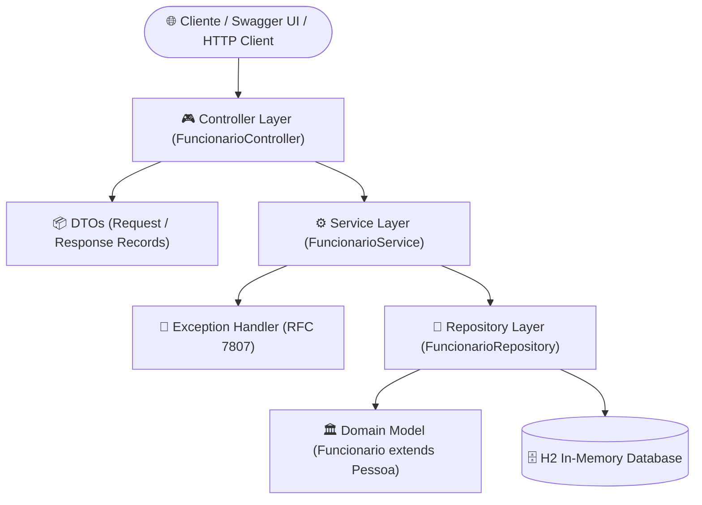

# 🚀 API de Gestão de Funcionários - Projedata

[](https://www.oracle.com/java/)
[](https://spring.io/projects/spring-boot)
[](https://www.docker.com/)
[](https://swagger.io/)
[](https://opensource.org/licenses/MIT)

> 🇧🇷 **Português** | 🇺🇸 [**English Version**](README.en.md)

API RESTful corporativa de alta performance para administração de funcionários, folhas de pagamento, reajustes percentuais em lote e cálculos estatísticos. Construída com **Java 21 LTS**, **Spring Boot 3.4.3**, **Spring Data JPA**, banco de dados em memória **H2**, documentação interativa via **Swagger UI (OpenAPI 3)** e containerização com **Docker & Docker Compose**.

## 📌 Sumário / Navegação Rápida

- [📝 Sobre o Projeto](#-sobre-o-projeto)
- [🖼️ Preview](#️-preview)
- [🌐 Demonstração Online do Swagger](#-demonstração-online-do-swagger)
- [⚡ API Endpoints](#-api-endpoints)
- [✨ Funcionalidades](#-funcionalidades)
- [🛠️ Tecnologias e Ferramentas Utilizadas](#️-tecnologias-e-ferramentas-utilizadas)
- [🏛️ Arquitetura da Solução](#️-arquitetura-da-solução)
- [📁 Estrutura do Repositório](#-estrutura-do-repositório)
- [💡 Decisões Técnicas](#-decisões-técnicas)
- [🚀 Como Executar o Projeto](#-como-executar-o-projeto)
  - [Pré-requisitos](#pré-requisitos)
  - [Opção 1: Via Docker Compose (Recomendado)](#opção-1-via-docker-compose-recomendado)
  - [Opção 2: Via Maven CLI](#opção-2-via-maven-cli)
  - [Opção 3: Execução em IDE](#opção-3-execução-em-ide)
- [🔍 Acessos e Links Úteis em Execução](#-acessos-e-links-úteis-em-execução)
- [📄 Licença](#-licença)

## 📝 Sobre o Projeto

Este projeto foi concebido originalmente a partir dos requisitos do teste prático técnico da **Projedata** para Desenvolvedor de Software e elevado para os mais rigorosos padrões da engenharia de software corporativa.

A aplicação modela a gestão completa do quadro de colaboradores da organização (`Pessoa` e `Funcionario`), orquestrando operações de cadastro, remoção por ID e por nome, aplicação de aumentos percentuais sincronizados em base de dados, agregação por cargo/função, filtros de aniversariantes específicos (meses 10 e 12), localização do colaborador com maior idade cronológica e cálculo da proporção da folha salarial individual em relação ao salário mínimo vigente.

## 🖼️ Preview

<div align="center">
  
</div>

## 🌐 Demonstração Online do Swagger

A aplicação está implantada e disponível na nuvem para experimentação em tempo real:

👉 **[https://teste-pratico-projedata-4kpw.onrender.com/](https://teste-pratico-projedata-4kpw.onrender.com/)**

> O acesso à raiz `/` redireciona automaticamente para o Swagger UI (`/swagger-ui/index.html`).

## ⚡ API Endpoints

A API é orientada pelo padrão RESTful, fornecendo payloads estruturados em JSON, tratamento consistente de códigos de status HTTP e validação automática.

| Método | Endpoint | Descrição | Parâmetros / Corpo |
| :--- | :--- | :--- | :--- |
| `GET` | `/api/v1/funcionarios` | Lista todos os funcionários | `ordenarPorNome=true/false` *(default: false)* |
| `GET` | `/api/v1/funcionarios/{id}` | Recupera funcionário por ID | `id` *(path variable)* |
| `POST` | `/api/v1/funcionarios` | Cadastra um novo funcionário | JSON Body (`FuncionarioRequestDTO`) |
| `DELETE` | `/api/v1/funcionarios/{id}` | Exclui funcionário por ID | `id` *(path variable)* |
| `DELETE` | `/api/v1/funcionarios/nome/{nome}` | Exclui funcionário por Nome *(Req. 3.2)* | `nome` *(path variable)* |
| `PATCH` | `/api/v1/funcionarios/reajuste` | Aplica reajuste salarial percentual a todos *(Req. 3.4)* | `percentual` *(query param, default: 10.0)* |
| `GET` | `/api/v1/funcionarios/agrupados-por-funcao` | Agrupa a lista de funcionários por cargo *(Req. 3.5 e 3.6)* | Nenhum |
| `GET` | `/api/v1/funcionarios/aniversariantes` | Filtra aniversariantes por mês *(Req. 3.8)* | `meses` *(query param, default: 10,12)* |
| `GET` | `/api/v1/funcionarios/mais-velho` | Retorna o funcionário mais idoso com idade calculada *(Req. 3.9)* | Nenhum |
| `GET` | `/api/v1/funcionarios/estatisticas/folha` | Total da folha e múltiplos de salários mínimos *(Req. 3.11 e 3.12)* | `salarioMinimo` *(query param, default: 1212.00)* |

## ✨ Funcionalidades

- **Carga Inicial Automática:** Alimentação idempotente no startup da aplicação com os 10 colaboradores da especificação técnica via `DataInitializer`.
- **Remoção de Colaboradores:** Exclusão dinâmica por nome (ex: "João") e por identificador único primário.
- **Formatação e Exibição de Dados:** Respostas serializadas com precisão monetária e formatação cronológica padrão.
- **Reajuste Salarial Coletivo:** Atualização transacional em lote do percentual informado (ex: +10%) com arredondamento estrito em `BigDecimal`.
- **Agrupamento por Função/Cargo:** Agrupamento relacional dinâmico `Map<String, List<Funcionario>>` através da Stream API.
- **Filtro de Aniversariantes:** Consulta flexível parametrizada por lista de meses (com padrão para os meses 10 e 12).
- **Identificação de Maior Idade :** Localização do colaborador mais experiente calculando a idade exata em anos com `java.time.Period`.
- **Ordenação Alfabética :** Consulta com suporte a ordenação nominal alfabética via query param `ordenarPorNome`.
- **Apuração Salarial e Estatísticas de Folha:** Somatório total da folha e indicador de quantos salários mínimos cada profissional recebe com base no piso parametrizado.

## 🛠️ Tecnologias e Ferramentas Utilizadas

| Camada / Finalidade | Tecnologia | Descrição |
| :--- | :--- | :--- |
| **Linguagem Principal** | **Java 21 LTS** | Uso de Records, Pattern Matching e melhorias do compilador |
| **Framework Web** | **Spring Boot 3.4.3** | Ecossistema moderno de injeção de dependências e microsserviços |
| **Persistência de Dados** | **Spring Data JPA / Hibernate** | Mapeamento Objeto-Relacional limpo com `@MappedSuperclass` |
| **Banco de Dados** | **H2 Database** | Banco relacional SQL em memória de rápida inicialização |
| **Validação** | **Jakarta Bean Validation** | Validações automáticas declarativas via anotações nos DTOs |
| **Documentação Interativa** | **Swagger UI / SpringDoc OpenAPI 2.8.5** | Especificação OpenAPI 3 viva e console de testes integrado |
| **Testes Automatizados** | **JUnit 5 & Mockito** | Testes de unidade cobrindo serviços e regras financeiras |
| **Containerização** | **Docker & Docker Compose** | Construção multi-stage em imagem leve Alpine |
| **Gerenciador de Build** | **Apache Maven** | Gestão de ciclo de vida de compilação e dependências |

## 🏛️ Arquitetura da Solução

O sistema foi arquitetado em camadas estritas e desacopladas, seguindo os princípios de **Clean Architecture**, **SOLID** e **DDD (Domain-Driven Design)**:


```mermaid
flowchart TD
    Client(["🌐 Cliente / Swagger UI / HTTP Client"]) --> Controller["🎮 Controller Layer (FuncionarioController)"]
    Controller --> DTO["📦 DTOs (Request / Response Records)"]
    Controller --> Service["⚙️ Service Layer (FuncionarioService)"]
    Service --> Exception["🚨 Exception Handler (RFC 7807)"]
    Service --> Repository["💾 Repository Layer (FuncionarioRepository)"]
    Repository --> Model["🏛️ Domain Model (Funcionario extends Pessoa)"]
    Repository --> Database[("🗄️ H2 In-Memory Database")]
```

- **Controller:** Ponto de entrada REST, roteamento, anotações Swagger OpenAPI e validação dos contratos de transporte.
- **DTO (Data Transfer Objects):** Records imutáveis de transferência desacoplando a camada externa das entidades de persistência.
- **Service:** Concentração das regras de negócio, cálculos financeiros com `BigDecimal`, transações com `@Transactional` e manipulação de fluxos com Java Streams.
- **Repository:** Abstração de acesso a dados alavancando o Spring Data JPA e queries orientadas a métodos.
- **Model:** Entidades de domínio mapeadas com JPA (`Pessoa` abstrata com `@MappedSuperclass` e `Funcionario` como entidade estendida).
- **Exception Handler:** Interceptador global `@RestControllerAdvice` padronizando respostas de erro com a especificação RFC 7807 (`ProblemDetail`).

## 📁 Estrutura do Repositório

```text
teste-pratico-projedata/
├── src/
│   ├── main/
│   │   ├── java/com/projedata/
│   │   │   ├── config/              # Configurações do OpenAPI/Swagger e Seed do H2
│   │   │   │   ├── DataInitializer.java
│   │   │   │   └── OpenApiConfig.java
│   │   │   ├── controller/          # Controladores REST da aplicação
│   │   │   │   ├── FuncionarioController.java
│   │   │   │   └── HomeController.java
│   │   │   ├── dto/                 # Records DTO de transporte e estatísticas
│   │   │   │   ├── FolhaEstatisticaResponseDTO.java
│   │   │   │   ├── FuncionarioMaisVelhoResponseDTO.java
│   │   │   │   ├── FuncionarioRequestDTO.java
│   │   │   │   └── FuncionarioResponseDTO.java
│   │   │   ├── exception/           # Tratamento Global de Erros (RFC 7807 ProblemDetail)
│   │   │   │   ├── GlobalExceptionHandler.java
│   │   │   │   └── ResourceNotFoundException.java
│   │   │   ├── model/               # Entidades de Domínio JPA
│   │   │   │   ├── Funcionario.java
│   │   │   │   └── Pessoa.java
│   │   │   ├── repository/          # Interfaces Spring Data JPA
│   │   │   │   └── FuncionarioRepository.java
│   │   │   ├── service/             # Camada de Serviços e Regras de Negócio
│   │   │   │   └── FuncionarioService.java
│   │   │   └── ProjedataApplication.java  # Ponto de entrada da aplicação
│   │   └── resources/
│   │       └── application.yml      # Parâmetros de infraestrutura, H2 e Swagger
│   └── test/
│       └── java/com/projedata/
│           └── service/
│               └── FuncionarioServiceTest.java # Testes Unitários com JUnit 5 & Mockito
├── Dockerfile                       # Multi-stage build com Eclipse Temurin JRE Alpine
├── docker-compose.yml               # Orquestração do container de produção
├── pom.xml                          # Dependências e plugins Maven
├── LICENSE                          # Licença MIT do projeto
├── README.md                        # Documentação em Português
└── README.en.md                     # Documentação em Inglês
```

## 💡 Decisões Técnicas

1. **Java 21 LTS e Records:** Adoção de Java Records para a criação de todos os DTOs de entrada e saída. Essa escolha assegura integridade por imutabilidade, elimina a necessidade de bibliotecas invasivas como Lombok e remove código redundante (*getters, equals, hashCode, toString*).
2. **Precisão Financeira Estrita (`BigDecimal`):** Salários, percentuais de reajuste e divisões por salário mínimo são tratados rigorosamente com `BigDecimal` e modo de arredondamento `RoundingMode.HALF_UP` em 2 casas decimais, eliminando imprecisões e erros de truncamento típicos de ponto flutuante (`float`/`double`).
3. **Padrão RFC 7807 (`ProblemDetail`):** Os erros da aplicação (como `ResourceNotFoundException` e violações de validação em `@Valid`) são capturados pelo `@RestControllerAdvice` e formatados na especificação RFC 7807, garantindo respostas de erro uniformes, previsíveis e de fácil consumo por clientes de API.
4. **Herança com `@MappedSuperclass`:** A entidade `Funcionario` herda os atributos essenciais (`id`, `nome`, `dataNascimento`) da superclasse abstrata `Pessoa` utilizando a anotação JPA `@MappedSuperclass`. Isso unifica o modelo orientado a objetos e gera uma tabela relacional coesa (`tb_funcionarios`).
5. **Docker Multi-Stage Build:** O `Dockerfile` é estruturado em dois estágios: o primeiro compila e empacota o JAR via `maven:3.9.6-eclipse-temurin-21`, enquanto o segundo apenas roda a aplicação sobre `eclipse-temurin:21-jre-alpine`. Isso minimiza drasticamente a superfície de ataque e o tamanho da imagem gerada.
6. **Redirecionamento Automático:** Implementação do `HomeController` direcionando a rota raiz (`/`) diretamente para a UI do Swagger (`/swagger-ui/index.html`), aprimorando a usabilidade em deploys em nuvem (Render, AWS, etc.).

## 🚀 Como Executar o Projeto

### Pré-requisitos
- Ter o **Docker & Docker Compose** instalado, **OU**
- Ter o **Java JDK 21** e **Apache Maven 3.8+** configurados no PATH.

### Opção 1: Via Docker Compose (Recomendado)

A forma mais rápida e isolada de executar a aplicação:

```bash
# 1. Clone o repositório
git clone https://github.com/ludson96/teste-pratico-projedata.git

# 2. Acesse a pasta raiz
cd teste-pratico-projedata

# 3. Construa a imagem e inicie o container
docker compose up --build
```
> Para liberar o terminal e executar em background: `docker compose up -d`  
> Para encerrar a execução: `docker compose down`

### Opção 2: Via Maven CLI

```bash
# 1. Clone e entre na pasta
git clone https://github.com/ludson96/teste-pratico-projedata.git
cd teste-pratico-projedata

# 2. Execute a suíte completa de testes unitários
mvn clean test

# 3. Inicie o servidor da aplicação
mvn spring-boot:run
```

### Opção 3: Execução em IDE

1. Abra sua IDE preferida (**IntelliJ IDEA**, **VS Code** ou **Eclipse**).
2. Abra a pasta raiz do projeto como um projeto **Maven**.
3. Certifique-se de configurar o **JDK 21** no `Project SDK`.
4. Execute a classe principal `com.projedata.ProjedataApplication`.

## 🔍 Acessos e Links Úteis em Execução

Com a aplicação rodando localmente na porta `8080`:

| Recurso | URL | Observação |
| :--- | :--- | :--- |
| 📄 **Swagger UI** | [http://localhost:8080/swagger-ui.html](http://localhost:8080/swagger-ui.html) | Documentação viva interativa |
| 📊 **OpenAPI JSON Spec** | [http://localhost:8080/v3/api-docs](http://localhost:8080/v3/api-docs) | Esquema técnico da OpenAPI |
| 🗄️ **Console Web H2** | [http://localhost:8080/h2-console](http://localhost:8080/h2-console) | Banco de dados em tempo de execução |

> **Credenciais do H2 Console:**  
> - **JDBC URL:** `jdbc:h2:mem:projedatadb`  
> - **User:** `sa`  
> - **Password:** *(deixar em branco)*

## 📄 Licença

Este projeto é distribuído sob os termos da licença [MIT](LICENSE). Consulte o arquivo de licença para mais detalhes.
