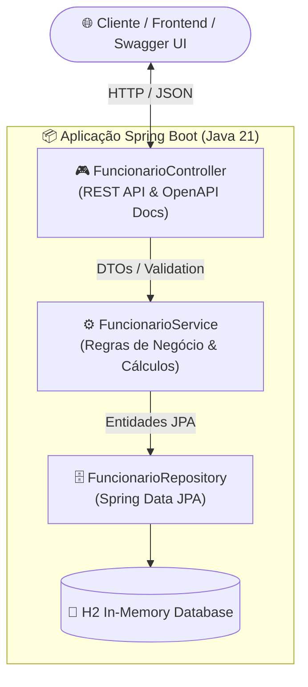

# 🚀 API de Gestão de Funcionários - `Projedata`

[![Java 21][Java-badge]][Java-url]
[![Spring Boot 3][Spring-badge]][Spring-url]
[![Swagger / OpenAPI 3][Swagger-badge]][Swagger-url]
[![Docker][Docker-badge]][Docker-url]
[![License: MIT][License-badge]](LICENSE)

API RESTful empresarial desenvolvida em **Java 21** e **Spring Boot 3**, aplicando persistência relacional com **Spring Data JPA**, banco de dados em memória **H2 Database**, documentação interativa via **Swagger UI (OpenAPI 3)**, testes automatizados e containerização com **Docker**.

---

## 🏛️ Arquitetura & Design de Software

A solução adota uma arquitetura em camadas bem definida e desacoplada:


```mermaid
flowchart TD
    Client(["🌐 Cliente / Frontend / Swagger UI"])
    
    subgraph SpringBootApp ["📦 Aplicação Spring Boot (Java 21)"]
        Controller["🎮 FuncionarioController<br>(REST API & OpenAPI Docs)"]
        Service["⚙️ FuncionarioService<br>(Regras de Negócio & Cálculos)"]
        Repo["🗄️ FuncionarioRepository<br>(Spring Data JPA)"]
        DB[("💾 H2 In-Memory Database")]
        
        Controller -->|DTOs / Validation| Service
        Service -->|Entidades JPA| Repo
        Repo --> DB
    end
    
    Client <-->|HTTP / JSON| Controller
```

---

## 📋 Funcionalidades e Requisitos Atendidos

| Requisito | Descrição | Endpoint REST |
| :--- | :--- | :--- |
| **3.1** | Inserção automática da carga inicial de funcionários | Executado via `DataInitializer` na subida do app |
| **3.2** | Remoção de funcionário por nome (ex: "João") ou ID | `DELETE /api/v1/funcionarios/nome/{nome}` ou `DELETE /{id}` |
| **3.3** | Listagem geral de funcionários com formatação | `GET /api/v1/funcionarios` |
| **3.4** | Aumento salarial percentual (ex: 10%) | `PATCH /api/v1/funcionarios/reajuste?percentual=10` |
| **3.5 & 3.6** | Agrupamento de funcionários por função | `GET /api/v1/funcionarios/agrupados-por-funcao` |
| **3.8** | Filtro de aniversariantes por meses (padrão: 10 e 12) | `GET /api/v1/funcionarios/aniversariantes?meses=10,12` |
| **3.9** | Funcionário com a maior idade e cálculo de anos | `GET /api/v1/funcionarios/mais-velho` |
| **3.10** | Listagem de funcionários por ordem alfabética | `GET /api/v1/funcionarios?ordenarPorNome=true` |
| **3.11 & 3.12**| Total de salários da folha e múltiplos de salários mínimos | `GET /api/v1/funcionarios/estatisticas/folha?salarioMinimo=1212.00` |

---

## 🛠️ Tecnologias Utilizadas

- **Java 21 LTS** (Records, Pattern Matching, Stream API e Time API moderna)
- **Spring Boot 3.4.x** (Spring MVC, Spring Data JPA, Bean Validation)
- **Springdoc OpenAPI 3 / Swagger UI**
- **H2 In-Memory Database** (com console web habilitado)
- **JUnit 5 & Mockito** (Testes unitários e de integração)
- **Maven & Docker Compose**

---

## 📖 Documentação Interativa (Swagger) e H2 Console

Com a aplicação em execução, acesse no navegador:

- **Swagger UI:** [http://localhost:8080/swagger-ui.html](http://localhost:8080/swagger-ui.html)
- **OpenAPI JSON Docs:** [http://localhost:8080/v3/api-docs](http://localhost:8080/v3/api-docs)
- **Console do Banco H2:** [http://localhost:8080/h2-console](http://localhost:8080/h2-console)
  - **JDBC URL:** `jdbc:h2:mem:projedatadb`
  - **User Name:** `sa`
  - **Password:** *(deixar em branco)*

---

## 🚀 Como Executar

### Opção 1: Via Docker Compose (Recomendado)
```bash
docker compose up --build
```

### Opção 2: Via IDE (IntelliJ / VS Code / Eclipse)
1. Importe o projeto como um projeto **Maven**.
2. Certifique-se de configurar o **JDK 21**.
3. Execute a classe principal `com.projedata.ProjedataApplication`.

### Opção 3: Via Maven CLI
```bash
# Executar a aplicação
mvn spring-boot:run

# Rodar os testes automatizados
mvn clean test
```

---

[Java-badge]: https://img.shields.io/badge/Java-21-ED8B00?style=for-the-badge&logo=openjdk&logoColor=white
[Java-url]: https://www.oracle.com/java/technologies/downloads/#java21
[Spring-badge]: https://img.shields.io/badge/Spring_Boot-3.4-6DB33F?style=for-the-badge&logo=springboot&logoColor=white
[Spring-url]: https://spring.io/projects/spring-boot
[Swagger-badge]: https://img.shields.io/badge/Swagger-OpenAPI_3-85EA2D?style=for-the-badge&logo=swagger&logoColor=black
[Swagger-url]: https://swagger.io/
[Docker-badge]: https://img.shields.io/badge/Docker-Enabled-2496ED?style=for-the-badge&logo=docker&logoColor=white
[Docker-url]: https://www.docker.com/
[License-badge]: https://img.shields.io/badge/License-MIT-blue.svg?style=for-the-badge
