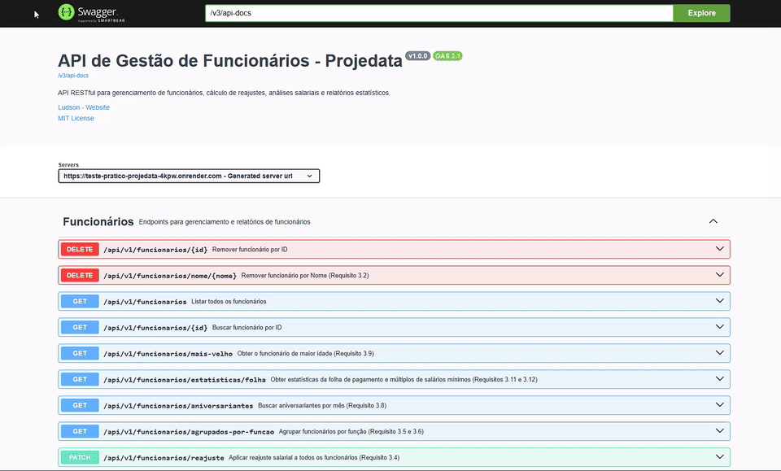

# 🚀 API de Gestão de Funcionários - `Projedata`

🌍 Read this in [English](README.en.md)

API RESTful corporativa desenvolvida em **Java 21** e **Spring Boot 3**, aplicando persistência de dados com **Spring Data JPA**, banco em memória **H2 Database**, documentação interativa via **Swagger UI (OpenAPI 3)**, validação de payload com **Bean Validation**, testes unitários automatizados com **JUnit 5 / Mockito** e containerização completa com **Docker & Docker Compose**.

## 🌐 Demonstração Online do Swagger

Acesse a aplicação em produção:
👉 **[Swagger](https://teste-pratico-projedata-4kpw.onrender.com)**

## 📝 Sobre o Projeto

Este projeto foi desenvolvido originalmente como resolução do teste prático técnico da **Projedata** (para a vaga de Desenvolvedor de Software) e evoluído para uma arquitetura profissional em camadas (*Controller*, *Service*, *Repository*, *Model*, *DTO*).

A aplicação gerencia um conjunto de funcionários com regras de negócio específicas, incluindo reajustes salariais percentuais em lote, cálculo de idade, agrupamento dinâmico por cargos, filtros de aniversariantes e apuração estatística da folha de pagamento baseada em múltiplos do salário mínimo vigente.

## 🖼️ Preview



## 🌐 API Endpoints

A API segue os padrões RESTful com retorno estruturado em JSON e códigos HTTP semânticos:

| Método | Endpoint | Descrição | Parâmetros / Query Params |
| :--- | :--- | :--- | :--- |
| `GET` | `/api/v1/funcionarios` | Lista todos os funcionários | `ordenarPorNome=true/false` *(default: false)* |
| `GET` | `/api/v1/funcionarios/{id}` | Busca funcionário por ID | `id` *(path variable)* |
| `POST` | `/api/v1/funcionarios` | Cadastra um novo funcionário | Body JSON (`FuncionarioRequestDTO`) |
| `DELETE` | `/api/v1/funcionarios/{id}` | Remove funcionário por ID | `id` *(path variable)* |
| `DELETE` | `/api/v1/funcionarios/nome/{nome}` | Remove funcionário por Nome | `nome` *(path variable)* |
| `PATCH` | `/api/v1/funcionarios/reajuste` | Aplica aumento percentual a todos | `percentual=10.0` *(default: 10.0)* |
| `GET` | `/api/v1/funcionarios/agrupados-por-funcao` | Agrupa os funcionários por cargo | — |
| `GET` | `/api/v1/funcionarios/aniversariantes` | Filtra aniversariantes por meses | `meses=10,12` *(default: 10,12)* |
| `GET` | `/api/v1/funcionarios/mais-velho` | Retorna o funcionário mais idoso e idade | — |
| `GET` | `/api/v1/funcionarios/estatisticas/folha` | Total da folha e salários mínimos por pessoa | `salarioMinimo=1212.00` *(default: 1212.00)* |

## ✨ Funcionalidades

- [x] **Carga Inicial Automática (Requisito 3.1):** Povoamento idempotente do banco com os 10 funcionários na inicialização via `DataInitializer`.
- [x] **Remoção de Funcionários (Requisito 3.2):** Exclusão por nome (ex: "João") ou por chave primária ID.
- [x] **Formatação e Exibição de Dados (Requisito 3.3):** Datas em padrão ISO/Custom e valores monetários com precisão decimal.
- [x] **Reajuste Salarial Dinâmico (Requisito 3.4):** Aumento percentual em lote (ex: 10%) recalculando a folha no banco.
- [x] **Agrupamento por Cargo (Requisitos 3.5 & 3.6):** Mapeamento dinâmico agrupando listas de funcionários por função exercida.
- [x] **Aniversariantes do Período (Requisito 3.8):** Consulta flexível para os meses 10 (outubro) e 12 (dezembro).
- [x] **Cálculo de Maior Idade (Requisito 3.9):** Apuração do funcionário mais velho calculando anos completos com `java.time.Period`.
- [x] **Ordenação Alfabética (Requisito 3.10):** Consulta com ordenação ascendente por nome.
- [x] **Totalização e Múltiplos Salariais (Requisitos 3.11 & 3.12):** Soma total dos salários e cálculo de quantos salários mínimos cada colaborador recebe.

## 📁 Estrutura do Repositório

```text
teste-pratico-projedata/
├── src/
│   ├── main/
│   │   ├── java/com/projedata/
│   │   │   ├── config/              # Configurações do Swagger OpenAPI e Carga Inicial (DataInitializer)
│   │   │   │   ├── DataInitializer.java
│   │   │   │   └── OpenApiConfig.java
│   │   │   ├── controller/          # Controladores REST com anotações OpenAPI
│   │   │   │   └── FuncionarioController.java
│   │   │   ├── dto/                 # Records DTO de Request, Response e Estatísticas
│   │   │   │   ├── FolhaEstatisticaResponseDTO.java
│   │   │   │   ├── FuncionarioMaisVelhoResponseDTO.java
│   │   │   │   ├── FuncionarioRequestDTO.java
│   │   │   │   └── FuncionarioResponseDTO.java
│   │   │   ├── exception/           # Tratamento Global de Erros (RFC 7807 ProblemDetail)
│   │   │   │   ├── GlobalExceptionHandler.java
│   │   │   │   └── ResourceNotFoundException.java
│   │   │   ├── model/               # Entidades de Domínio JPA
│   │   │   │   ├── Funcionario.java
│   │   │   │   └── Pessoa.java
│   │   │   ├── repository/          # Repositórios Spring Data JPA
│   │   │   │   └── FuncionarioRepository.java
│   │   │   ├── service/             # Camada de Regras de Negócio e Cálculos Financeiros
│   │   │   │   └── FuncionarioService.java
│   │   │   └── ProjedataApplication.java  # Classe Principal de Inicialização
│   │   └── resources/
│   │       └── application.yml      # Configurações de Porta, H2 e Swagger UI
│   └── test/
│       └── java/com/projedata/
│           └── service/
│               └── FuncionarioServiceTest.java # Testes Unitários com JUnit 5 & Mockito
├── Dockerfile                       # Build Multi-Stage com Eclipse Temurin JDK 21
├── docker-compose.yml               # Orquestração do Container
├── pom.xml                          # Gerenciador de Dependências Maven
└── README.md                        # Documentação do Projeto
```

## 🛠️ Tecnologias Utilizadas

| Categoria | Tecnologia |
| :--- | :--- |
| **Linguagem** | [![Java][Java-logo]][Java-url] |
| **Backend & Framework** | [![Spring Boot][Spring-Boot-logo]][Spring-Boot-url] [![Spring Data JPA][Spring-JPA-logo]][Spring-JPA-url] |
| **Banco de Dados** | [![H2 Database][H2-logo]][H2-url] |
| **Documentação API** | [![Swagger][Swagger-logo]][Swagger-url] [![OpenAPI][OpenAPI-logo]][OpenAPI-url] |
| **Testes** | [![JUnit 5][JUnit5-logo]][JUnit5-url] [![Mockito][Mockito-logo]][Mockito-url] |
| **DevOps & Containers** | [![Docker][Docker-logo]][Docker-url] [![Docker Compose][Docker-Compose-logo]][Docker-Compose-url] [![Maven][Maven-logo]][Maven-url] |
| **Versionamento** | [![Git][Git-logo]][Git-url] |

[Java-logo]: https://img.shields.io/badge/java-%23ED8B00.svg?style=for-the-badge&logo=openjdk&logoColor=white
[Java-url]: https://www.oracle.com/java/technologies/downloads/#java21
[Spring-Boot-logo]: https://img.shields.io/badge/spring_boot-%236DB33F.svg?style=for-the-badge&logo=springboot&logoColor=white
[Spring-Boot-url]: https://spring.io/projects/spring-boot
[Spring-JPA-logo]: https://img.shields.io/badge/spring_data_jpa-%236DB33F.svg?style=for-the-badge&logo=hibernate&logoColor=white
[Spring-JPA-url]: https://spring.io/projects/spring-data-jpa
[H2-logo]: https://img.shields.io/badge/H2_Database-%23003B57.svg?style=for-the-badge&logo=h2&logoColor=white
[H2-url]: https://www.h2database.com/
[Swagger-logo]: https://img.shields.io/badge/Swagger-%2385EA2D.svg?style=for-the-badge&logo=swagger&logoColor=black
[Swagger-url]: https://swagger.io/
[OpenAPI-logo]: https://img.shields.io/badge/OpenAPI-%236BA539.svg?style=for-the-badge&logo=openapiinitiative&logoColor=white
[OpenAPI-url]: https://www.openapis.org/
[JUnit5-logo]: https://img.shields.io/badge/JUnit5-%2325A162.svg?style=for-the-badge&logo=junit5&logoColor=white
[JUnit5-url]: https://junit.org/junit5/
[Mockito-logo]: https://img.shields.io/badge/Mockito-%23C5E063.svg?style=for-the-badge
[Mockito-url]: https://site.mockito.org/
[Docker-logo]: https://img.shields.io/badge/docker-%232496ED.svg?style=for-the-badge&logo=docker&logoColor=white
[Docker-url]: https://www.docker.com/
[Docker-Compose-logo]: https://img.shields.io/badge/Docker_Compose-%232496ED.svg?style=for-the-badge&logo=docker&logoColor=white
[Docker-Compose-url]: https://docs.docker.com/compose/
[Maven-logo]: https://img.shields.io/badge/Apache_Maven-%23C71A36.svg?style=for-the-badge&logo=apachemaven&logoColor=white
[Maven-url]: https://maven.apache.org/
[Git-logo]: https://img.shields.io/badge/git-%23F05033.svg?style=for-the-badge&logo=git&logoColor=white
[Git-url]: https://git-scm.com

## 💡 Decisões Técnicas

1. **Java 21 LTS + Records:** Utilização de `record` para todos os DTOs de entrada e saída, garantindo imutabilidade, código conciso e ausência de boilerplate (*getters*, *equals*, *hashCode*, *toString*).
2. **Precisão Financeira (`BigDecimal`):** Uso rigoroso de `BigDecimal` com arredondamento `RoundingMode.HALF_UP` e 2 casas decimais em todos os cálculos salariais e divisões por salário mínimo, prevenindo perdas de precisão de ponto flutuante.
3. **Padrão RFC 7807 (`ProblemDetail`):** Implementação de tratamento global de exceções via `@RestControllerAdvice` retornando respostas de erro detalhadas e padronizadas para validações e recursos não encontrados.
4. **Build Otimizado Multi-Stage no Docker:** Separação do estágio de compilação com Maven da imagem final de execução (baseada na JRE Alpine ultra leve), reduzindo drasticamente o tamanho final da imagem e aumentando a segurança.
5. **Spring Data JPA com MappedSuperclass:** Herança entre a entidade `Funcionario` e a superclasse abstrata `Pessoa` utilizando `@MappedSuperclass`, mantendo o modelo orientado a objetos alinhado à persistência relacional limpa.

## 🚀 Como Executar o Projeto

### Pré-requisitos
- Ter o **Docker & Docker Compose** instalado OU **Java JDK 21** e **Maven**.

### Opção 1: Via Docker Compose (Recomendado)
```bash
# 1. Clone o repositório
git clone https://github.com/ludson96/teste-pratico-projedata.git

# 2. Acesse a pasta do projeto
cd teste-pratico-projedata

# 3. Suba o container com build automático
docker compose up --build
```
> Para rodar em segundo plano (modo detached), use `docker compose up -d`.


### Opção 2: Via IDE (IntelliJ IDEA / VS Code / Eclipse)
1. Importe o diretório como um projeto **Maven**.
2. Configure o SDK/JDK do projeto para **Java 21**.
3. Execute o método `main` na classe `com.projedata.ProjedataApplication`.


### Opção 3: Via Maven CLI
```bash
# Executar a aplicação
mvn spring-boot:run

# Executar a suíte de testes unitários
mvn clean test
```

## 🔍 Links Úteis com o App em Execução

- 📄 **Swagger UI (Documentação Interativa):** [http://localhost:8080/swagger-ui.html](http://localhost:8080/swagger-ui.html)
- 📊 **OpenAPI JSON Spec:** [http://localhost:8080/v3/api-docs](http://localhost:8080/v3/api-docs)
- 🗄️ **Console Web H2:** [http://localhost:8080/h2-console](http://localhost:8080/h2-console)
  - **JDBC URL:** `jdbc:h2:mem:projedatadb`
  - **User:** `sa`
  - **Password:** *(deixar em branco)*


## 📄 Licença

Este projeto está sob a licença [MIT](LICENSE).
